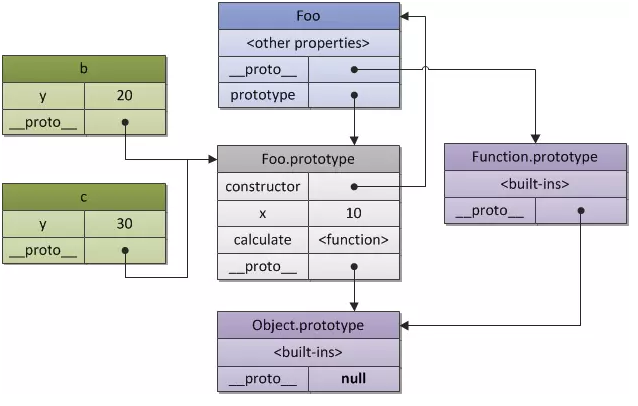

### 原型链



**`prototype`**

prototype **是函数独有的**，是函数的原型对象，这个对象包含所有实例共享的属性和方法


**`_proto_`**

`_proto_` **是对象独有的**，是原型链实际查询中用到的，它指向构造函数的原型对象

```
属性 -> Foo.prototype -> Object.prototype -> null

Foo -> Function.prototype -> Object.prototype -> null
```

#### 原型的作用是什么

因为js语言要实现面向对象，而原型是面向对象的实现手段之一。


### 继承

```js
// 定义一个基类
function Animal (name) {
}

1. 原型链继承
// 将父类的实例，作为子类的原型
function Cat(){ 
}
Cat.prototype = new Animal();

2. 构造继承
// 使用父类的构造函数来增强子类实例，等于是复制父类的实例属性给子类
function Cat(name){
  Animal.call(this);
  this.name = name || 'Tom';
}

3. 组合继承
// 通过调用父类构造，继承父类的属性并保留传参的优点，然后通过将父类实例作为子类原型，实现函数复用
function Cat(name){
  Animal.call(this);
  this.name = name || 'Tom';
}
Cat.prototype = new Animal();
```
