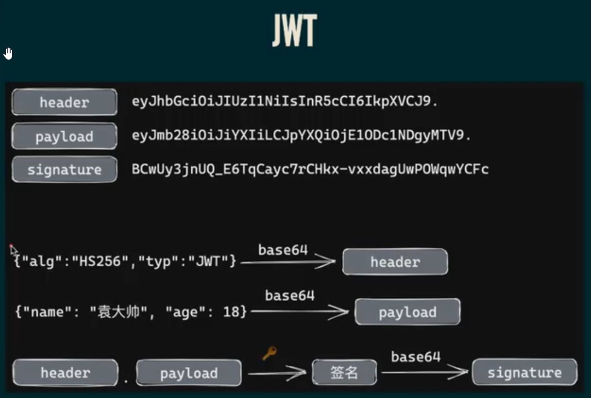
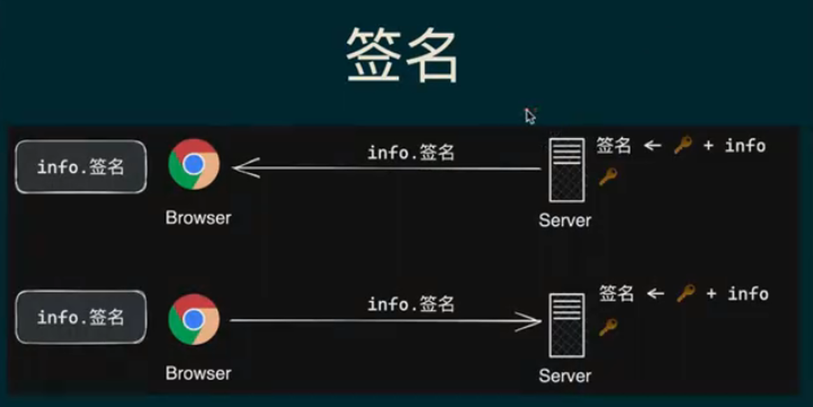

## 其他

### 判断函数是不是异步函数

Symbol.toStringTag   知名函数

```js
function isAsyncFunction(func) {
  return func[Symbol.toStringTag] === "AsyncFunction";
}
```


# 2. 性能优化


## 打包文件过大，如何优化  - 待补充

```js
1. 组件按需加载
2. 路由懒加载
3. 在 vue.config.js 中配置，去掉生成map文件
   module.exports = {
     productionSourceMap: false,
   }
4. 对项目代码中的JS/CSS文件进行gzip压缩
   npm i --save-dev compression-webpack-plugin
   module.exports = {
     productionGzip: true,
     productionGzipExtensions: ['js', 'css']
   }

`性能优化`
5. 图片懒加载
6. 抽取公共样式和方法
7. 使用 <keep-alive> 缓存路由切换的组件 <router-view>
```


### 如何分析是什么导致文件过大

使用 webpack-bundle-analyzer 分析


## 请求如何优化  - 待补充


## 多入口配置

```js
module.exports = {
  lintOnSave: false,

  // 多入口配置
  pages: {
    views: {
      entry: './src/main.js',
      template: 'public/index.html',
      filename: "index.html",
      title: 'views',
    },
    chart: {
      entry: "./src/entries/chart/main.js",
      template: "public/chart.html",
      filename: "chart.html",
      title: 'chart'
    },
    element: {
      entry: "./src/entries/element/main.js",
      template: "public/element.html",
      filename: "element.html",
      title: 'element'
    }
  }
}
```


# Vue 3

## 什么是Vue的响应式

Vue响应式数据是为了实现数据和函数的联动，当数据变化后，用到该数据的函数会自动重新运行。

渲染函数，是其中一种函数。


# LESS

## 自动注入 LESS 全局变量

vite.config.js

```js
{  
  css: {
    // css预处理器
    preprocessorOptions: {
      less: {
        charset: false,
        // 在 additionalData 里配置全局变量
        additionalData: '@import "./src/assets/style/global.less";',
      },
    },
  }
}
```


# 3. 其他

## HTTP

### GET 和 POST 的区别

GET 请求体为空

### 状态码

2**  成功

3**  重定向

4**  客户端错误，请求包含语法错误或无法完成请求

5**  服务端错误，服务器在处理请求的过程中发生了错误


## JWT Token

为了防止篡改和伪造用户信息，在token上添加签名。秘钥只有服务器知道，没有秘钥，无法伪造相同的签名。






## 单点登录  - 待补充


## 跨域请求  - 待补充

```js
```


## lodash  - 待补充

```js
debounce 防抖，一段时间内只执行最后一次，比如用户输入完成时进行校验
throttle 节流，一段时间内只执行第一次，比如窗口滚动
```


## eslint配置

package.json

```json
{
  "eslintConfig": {
    "extends": [
      "eslint:recommended" // 默认是 "@vue/standard"
    ]
  }
}
```


